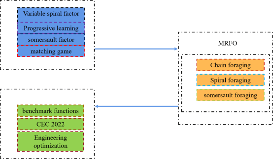

# MGL-MRFO
Donglin Zhu, Siwei Wang, Changjun Zhou, Shaoqiang Yan, 
Manta ray foraging optimization based on mechanics game and progressive learning for multiple  optimization problems, 
Applied Soft Computing, 
Volume 145, 
2023, 
110561, 
ISSN 1568-4946, 
https://doi.org/10.1016/j.asoc.2023.110561. 
(https://www.sciencedirect.com/science/article/pii/S1568494623005793) 
Abstract: Metaheuristic algorithms are currently being studied in depth by many scholars, and it is an important task to improve the learning and adaptive capabilities of the algorithms so that they can be of great use in a wide range of optimization problems. The Manta ray foraging optimization (MRFO) has made certain achievements in optimization problems, but it still has shortcomings, such as its insufficient intra-population communication and poor learning ability, so the optimization capability of MRFO needs further improvement. To address these shortcomings, this paper proposes a manta ray foraging optimization based on mechanics game and progressive learning for multiple optimization problems, which is abbreviated as MGL-MRFO, introducing variable spiral factors and dynamic adjustment of internal parameters; then proposes progressive learning to enhance the learning ability of MRFO; and finally proposes a matching game-based update mechanism to eliminate intra-population repetition as a feasible solution. It is validated in terms of move step size and time complexity. The results are compared with variants of the algorithm proposed in recent years in 18 benchmark test functions and the CEC 2022 test set, as well as with the TOP algorithm in the CEC competition, and show that MGL-MRFO has strong advantages, validating the novelty and competitiveness of MGL-MRFO. At the end of the paper, the feasibility and practicality of MGL-MRFO is further validated by three engineering optimization problems.
Keywords: Metaheuristic algorithms; Manta ray foraging optimization; Variable spiral factor; Matching game; Progressive learning; Benchmark function; CEC 2022; Engineering optimization problems

